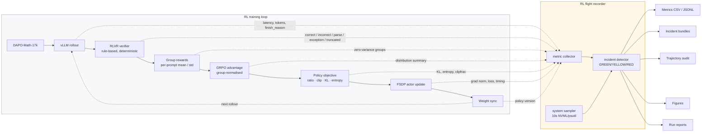

<div align="center">

# Qwen3-8B GRPO / DAPO Systems Lab

### An instrumented RLVR study of policy optimization, rollout dynamics, and failure modes


</div>

---

This repository is an **instrumented study of reinforcement learning for Qwen3-8B**,
not a collection of training scripts.

The central question:

> When an RL run improves, stalls, or collapses, can we explain the change from the
> underlying rollout, reward, policy-update, and systems signals?

A higher reward number is not the deliverable. The deliverable is being able to say
*why* the number moved — and, just as often, to show that it moved for a reason that has
nothing to do with the policy at all.

**Stack:** Qwen3-8B · VeRL · DAPO-Math-17k · RLVR · GRPO / DAPO · 4×H20 NVLink

> **Scope.** Everything here is a **GRPO systems pilot / rehearsal** applied directly to
> the released post-trained `Qwen/Qwen3-8B`. It is **not** the `M3` checkpoint of the
> author's medical paper, whose design is `Qwen3-8B → SFT (M1) → DPO (M2) → GRPO (M3)`.
> No result here may be presented as that M3.

---

## Research Question

RL training failures are routinely misattributed. A reward curve that falls looks the
same whether the policy degraded, the verifier stopped parsing, the length cap truncated
every answer, or a batch happened to contain unsolvable prompts. The reward curve alone
cannot tell these apart.

This lab is built on the premise that **`reward` is an output of a pipeline, not ground
truth**, and instruments every stage of that pipeline so each hypothesis can be
falsified independently.

---

## System Architecture



The recorder **observes, records, derives, alerts and captures evidence. It never
trains.** It cannot modify reward, advantage, optimizer state, learning rate, KL
coefficient, `rollout.n` or batch size. An observer that edits the experiment is no
longer measuring it.

---

## Experimental Program

| Run | Question it answers |
|---|---|
| **R0** — GRPO smoke | Does one optimizer update's data flow account for every stage, end to end? |
| **R1** — Vanilla GRPO | What do real GRPO dynamics look like, and what fraction of the batch actually carries gradient? |
| **R2** — DAPO, matched budget | What do clip-higher, dynamic sampling, token-level PG loss and overlong shaping each change — and at what rollout cost? |
| **R3-A** — Truncation contamination | Is a reward drop caused by a length cap distinguishable from policy degradation? |
| **R3-B** — Excessive LR | What is the measurable signature of a step size that is too large? |
| **R3-C** — Verifier timeout contamination | How does a ~5% verifier failure rate poison the reward signal, and does correct handling recover it? |

---

## Observability Stack

| Layer | Signals recorded | Failure modes it separates |
|---|---|---|
| **Rollout** | latency, tokens, `finish_reason`, length distribution, truncation rate | truncation contamination, length explosion, KV-cache pressure |
| **Verifier** | `OK_CORRECT` / `OK_INCORRECT` / `PARSE_FAILURE` / `VERIFIER_EXCEPTION` / `TRUNCATED`, latency p50/p95 | parse failure vs wrong answer vs verifier crash |
| **Group signal** | group mean/std, all-correct, all-wrong, mixed, zero-std, **effective signal fraction** | dataset too easy / too hard, effective-batch collapse |
| **Advantage** | mean, std, min, max, non-finite detection | zero-advantage batches, heavy tails |
| **Policy update** | KL, entropy, clip fraction (low/high), grad norm, policy loss | instability, entropy collapse, trust-region saturation |
| **Provenance** | rollout policy version, consuming step, **staleness** | stale rollouts invalidating the importance ratio |
| **Systems** | per-stage wall time and its share, GPU util/mem/temp/power, CPU, RAM, disk | *why* GPU utilization is low, not merely that it is |

Full definitions and the real VeRL key behind each metric:
[`docs/observability/metric_dictionary.md`](docs/observability/metric_dictionary.md).

**Metrics the current VeRL build does not emit are recorded as `unavailable`, never as
`0`.** A zero and a missing measurement mean different things.

---

## Current Status

<!-- STATUS_START -->
| Stage | Status |
|---|---|
| Infrastructure validation | **PASS** |
| CUDA 13 / torch 2.11 stack | **PASS** |
| Qwen3-8B via vLLM 0.24 | **PASS** |
| 4-GPU NCCL (349.8 GB/s busBW) | **PASS** |
| RLVR verifier gate | **PASS** |
| Flight recorder | **READY** |
| R0 — GRPO smoke | **NOT RUN** |
| R1 — Vanilla GRPO | **BLOCKED** — response-length budget unresolved |
| R2 — DAPO | **NOT RUN** |
| R3 — Failure injection | **NOT RUN** |
<!-- STATUS_END -->

The status block above is the only region of this file written automatically
(by [`scripts/monitoring/github_sync.py`](scripts/monitoring/github_sync.py)); everything
else is edited deliberately.

---

## Latest Diagnostics

No training figures yet — **awaiting R0**. No plot in this repository is generated from
data that was not measured.

The pre-RL fixed-policy rollout (64 prompts × G=8, 512 samples) has been measured and is
reported in [`analysis/pre_rl_reward_distribution.md`](analysis/pre_rl_reward_distribution.md).

---

## Engineering Findings

Only facts supported by a measurement in this repository appear here.

| Finding | Evidence | Reference |
|---|---|---|
| The current VeRL pins a CUDA-13 world (`torch 2.11.0+cu130`, `vLLM 0.24.0`, `flash-attn 2.8.3`) incompatible with the node's ambient `torch 2.8.0+cu128`; an isolated uv venv resolves it without touching the base install | 5 runtime gates passed: BF16, imports, FlashAttention sm90 kernel (max abs diff vs SDPA 0.0078), 4-rank NCCL 349.8 GB/s, vLLM Qwen3-8B generation | [`analysis/PRE_RL_GATE_REPORT.md`](analysis/PRE_RL_GATE_REPORT.md) |
| **DAPO-Math-17k contains 1,791,700 rows but only 17,917 unique prompts — each repeated exactly 100×** | `min repeats = max repeats = 100` over distinct `extra_info.index` | [`manifests/dataset.md`](manifests/dataset.md) |
| All 17,917 unique ground truths are **plain integers**, so symbolic-equivalence verification buys little here | format classification over the deduplicated answer set | [`analysis/verifier_unit_test.md`](analysis/verifier_unit_test.md) |
| The official `math_dapo` verifier scores **+1.0 / −1.0**, and maps *unparseable* to the same −1.0 as *wrong* | 440 constructed cases | [`analysis/verifier_semantics.md`](analysis/verifier_semantics.md) |
| The verifier inspects only the **last 300 characters** of a response (boxed fallback: last 100); correct answers beyond that window score −1.0 | 0/40 constructed cases survived; 6.05% incidence in 512 real rollouts | [`analysis/verifier_semantics.md`](analysis/verifier_semantics.md) |
| **Qwen3-8B thinking mode makes `max_response_length=4096` unusable on this data: 87.1% truncation, 79.7% zero-variance groups, and only 2/512 samples were genuinely wrong answers** | 512-sample fixed-policy rollout; response-length median sits exactly on the cap | [`analysis/pre_rl_reward_distribution.md`](analysis/pre_rl_reward_distribution.md) |
| Verifier cost is negligible (0.017 ms mean, 0% exceptions), so reward computation can be excluded as a throughput bottleneck by inspection | 440 cases + 512 rollouts | [`analysis/verifier_unit_test.md`](analysis/verifier_unit_test.md) |
| Three infrastructure faults on this node presented as dependency errors and were actually network routing | INC-001 split-routed proxy, INC-002 git subprocess proxy, INC-003 `uv --frozen` ignores `UV_DEFAULT_INDEX` (0.1 → 46.6 MB/s, ~460×) | [`analysis/incident_log.md`](analysis/incident_log.md) |

---

## Failure Taxonomy

| Family | Instances observed so far |
|---|---|
| **Data** | 100× prompt repetition; duplicate prompts within a batch double-weight in GRPO |
| **Reward / verifier** | parse failure scored as wrong answer; 300-char extraction window; trailing-period false negative (dormant) |
| **Policy** | none observed yet |
| **Optimization** | none observed yet |
| **Rollout** | truncation contamination at 87.1% (the dominant pre-R0 finding) |
| **Infrastructure** | INC-001, INC-002, INC-003 |

A single symptom — "reward went down" — can originate in any of these six. That is
precisely why the other five are instrumented.

---

## Reproducibility Contract

Every run records: run id, VeRL commit, model revision, dataset SHA, seed, fully
resolved config, hardware snapshot, environment lock, checkpoint ids, and restart
boundaries.

- **Restarted runs are never stitched into one curve.** Every restart leaves a visible
  `RESTART` marker in the figures.
- **Every figure is regenerable** from the committed CSVs by
  [`scripts/monitoring/plot_live_metrics.py`](scripts/monitoring/plot_live_metrics.py).
  Nothing is exported from a dashboard.
- **Raw traces are always plotted** alongside any smoothed overlay; a smoothed-only plot
  hides exactly the spikes this project studies.
- Weights, optimizer state, datasets, HF cache and full rollout dumps are **not**
  committed; they are referenced by run id, step, path and hash.
- `uv.lock` is locally modified to retarget PyPI URLs to a fast mirror. Versions and all
  1413 sha256 hashes are unchanged and still verified — see INC-003.

---

## Repository Map

```
docs/
  experiment_plan.md        stage gates, run definitions, checkpoint policy
  rl_pipeline_notes.md      official Qwen3-8B GRPO config, read from source
  debugging_playbook.md     reward-is-not-ground-truth checklist
  hardware_environment.md   measured hardware and interconnect
  observability/            architecture, metric dictionary, incident taxonomy,
                            diagnosis playbook
scripts/
  monitoring/               the flight recorder
  evaluation/               verifier unit test, fixed-policy rollout, length probe
  training/                 run_with_observer.sh
analysis/                   source traces, verifier reports, incident log, gate reports
experiments/<RUN_ID>/       telemetry, metrics, trajectories, incidents, figures,
                            run_manifest.json, RUN_REPORT.md
manifests/                  hardware, versions, dataset, model, pip freeze
status/                     live run status
```

---

## Citation / Acknowledgements

- **VeRL** — [verl-project/verl](https://github.com/verl-project/verl), the training framework (commit `1252cc71`)
- **Qwen3** — [Qwen/Qwen3-8B](https://huggingface.co/Qwen/Qwen3-8B)
- **DAPO** — [BytedTsinghua-SIA/DAPO](https://github.com/BytedTsinghua-SIA/DAPO), algorithm and dataset

This lab reproduces the official VeRL reward path rather than reimplementing it; any
deviation is documented and justified in `analysis/`.
