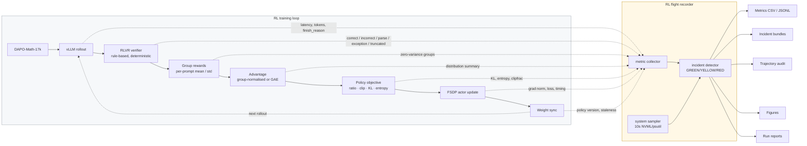

<div align="center">

# Qwen3-8B GRPO / DAPO Systems Lab

### An instrumented RLVR study of policy optimization, rollout dynamics, and failure modes

[](https://huggingface.co/Qwen/Qwen3-8B)
[](https://github.com/verl-project/verl)
[](docs/algorithm_matrix.md)
[](docs/hardware_environment.md)
[](manifests/versions.txt)
[](analysis/VERIFIER_GATE_REPORT.md)

[](analysis/PRE_RL_GATE_REPORT.md)
[](analysis/VERIFIER_GATE_REPORT.md)
[](analysis/R0_smoke_report.md)
[](docs/observability/architecture.md)
[](manifests/hardware.txt)
[](analysis/incident_log.md)

</div>

---

This repository is an **instrumented study of reinforcement learning for Qwen3-8B**,
not a collection of training scripts.

The central question:

> When an RL run improves, stalls, or collapses, can we explain the change from the
> underlying rollout, reward, policy-update, and systems signals?

A higher reward number is not the deliverable. The deliverable is being able to say
*why* the number moved — and, just as often, to show that it moved for a reason that has
nothing to do with the policy at all.

**Stack:** Qwen3-8B · VeRL · DAPO-Math-17k · RLVR · GRPO / Dr.GRPO / DAPO / GSPO / VAPO · 4×H20 NVLink

> **Scope.** Everything here is a **GRPO systems pilot / rehearsal** applied directly to
> the released post-trained `Qwen/Qwen3-8B`. It is **not** the `M3` checkpoint of the
> author's medical paper, whose design is `Qwen3-8B → SFT (M1) → DPO (M2) → GRPO (M3)`.
> No result here may be presented as that M3.

---

## Research Question

RL training failures are routinely misattributed. A reward curve that falls looks the
same whether the policy degraded, the verifier stopped parsing, the length cap truncated
every answer, or a batch happened to contain unsolvable prompts. The reward curve alone
cannot tell these apart.

This lab is built on the premise that **`reward` is an output of a pipeline, not ground
truth**, and instruments every stage so each hypothesis can be falsified independently.

**This has already paid off before a single long run:** the pre-RL rollout showed reward
−0.746 at 12.7% accuracy, which reads as a weak policy. It was not. **Only 2 of 512
samples were genuinely wrong answers** — 87% were truncated mid-reasoning. Raising the
length budget moved accuracy 12.7% → 56.25% with *identical weights*.

---

## System Architecture



The recorder **observes, records, derives, alerts and captures evidence. It never
trains.** It cannot modify reward, advantage, optimizer state, learning rate, KL
coefficient, `rollout.n` or batch size.

---

## Experimental Program

### Policy-optimization comparison suite

Five methods, studied as **interventions on specific pipeline layers** — not as five
trainers racing for reward. Full detail: [`docs/algorithm_matrix.md`](docs/algorithm_matrix.md).

| Algorithm | Optimization unit | Critic | Core intervention | Primary diagnostic question |
|---|---|---|---|---|
| **GRPO** — control | token ratio, group-normalised advantage | no | — (baseline) | What do real GRPO dynamics look like, and how much of the batch carries gradient? |
| **Dr.GRPO** — bias correction | token ratio, **mean-only** advantage | no | removes group-**std** and per-sequence **length** normalization | How much of GRPO's response-length growth is optimization bias rather than reasoning? |
| **DAPO** — group-signal engineering | token ratio | no | clip-higher · dynamic sampling · token-level PG · overlong shaping | What do dynamic sampling and asymmetric clipping actually change, and at what token cost? |
| **GSPO** — sequence-level | **sequence ratio** (length-normalised) | no | clipping decided per sequence, not per token | Do a few extreme token ratios dominate clipping, and does GSPO suppress that? |
| **VAPO** — cross-paradigm | token ratio, **GAE** | **yes** | brings the value function back | Does a critic give better credit assignment on long CoT, and at what cost? |

| Run | Purpose | Status |
|---|---|---|
| **R0** | GRPO smoke — prove one update's data flow end to end | ✅ **PASS** |
| **R1** | Vanilla GRPO baseline — the control | 🔜 next |
| **R2** | DAPO, matched budget | 📋 planned |
| **R_dr_grpo** | Dr.GRPO bias correction | 📋 planned |
| **R_gspo** | GSPO sequence-level ratio | 📋 planned |
| **R_vapo** | VAPO — **not implemented upstream**, feasibility only | 🚧 [feasibility report](analysis/vapo_feasibility.md) |
| **R3-A/B/C** | Failure injection: truncation · excessive LR · verifier timeout | 📋 planned |

Budget discipline: every algorithm gets a **2-update smoke test**, then a **20-update short
run**, and only then 50–150 updates *if its dynamics prove worth the GPU-hours*.
Comparisons are matched on **generated-token budget**, not just optimizer updates, because
dynamic sampling makes "100 updates" a non-comparable unit across arms.

---

## Observability Stack

| Layer | Signals recorded | Failure modes it separates |
|---|---|---|
| **Rollout** | latency, tokens, `finish_reason`, length distribution, truncation rate | truncation contamination, length explosion, KV-cache pressure |
| **Verifier** | `OK_CORRECT` / `OK_INCORRECT` / `PARSE_FAILURE` / `VERIFIER_EXCEPTION` / `TRUNCATED`, latency p50/p95 | parse failure vs wrong answer vs verifier crash |
| **Group signal** | group mean/std, all-correct, all-wrong, mixed, zero-std, **effective signal fraction** | dataset too easy / too hard, effective-batch collapse |
| **Advantage** | mean, std, min, max, non-finite detection | zero-advantage batches, heavy tails |
| **Policy update** | KL, entropy, clip fraction (low/high), grad norm, policy loss | instability, entropy collapse, trust-region saturation |
| **Provenance** | rollout policy version, consuming step, **staleness**, rollout↔train prob correlation | stale rollouts invalidating the importance ratio |
| **Value** *(critic arms)* | value/return mean·std, explained variance, value loss, per-length-bucket value error | value bias and credit decay on long CoT |
| **Systems** | per-stage wall time and share, GPU util/mem/temp/power, CPU, RAM, disk | *why* GPU utilization is low, not merely that it is |

Definitions and the real VeRL key behind each metric:
[`docs/observability/metric_dictionary.md`](docs/observability/metric_dictionary.md).

**Metrics the current VeRL build does not emit are recorded as `unavailable`, never as
`0`.** A zero and a missing measurement mean different things.

---

## Current Status

<!-- STATUS_START -->
| Stage | Status |
|---|---|
| Infrastructure validation | **PASS** |
| CUDA 13 / torch 2.11 stack | **PASS** |
| Qwen3-8B via vLLM 0.24 | **PASS** |
| 4-GPU NCCL (349.8 GB/s busBW) | **PASS** |
| RLVR verifier gate | **PASS** |
| Flight recorder | **ACTIVE** |
| R0 — GRPO smoke | **IN PROGRESS** |
| R1 — Vanilla GRPO | **NOT RUN** |
| R2 — DAPO | **NOT RUN** |
| R3 — Failure injection | **NOT RUN** |

**Live run** `R1_grpo_baseline` · step **18** ·
health **YELLOW** · reward 0.0625 ·
KL -0.00002 · entropy 0.3584 ·
effective signal 0.69 ·
incidents 3

_Auto-updated 2026-09-10T14:17:00 by `scripts/monitoring/github_sync.py`. Full status: [`status/latest.md`](status/latest.md)._
<!-- STATUS_END -->

The status block above is the only region of this file written automatically
(by [`scripts/monitoring/github_sync.py`](scripts/monitoring/github_sync.py)).

---

## Latest Diagnostics — R0

First real GRPO updates, recorded end to end
([full report](analysis/R0_smoke_report.md) · [figures](experiments/R0_grpo_smoke/figures)):

| metric | update 1 | update 2 |
|---|---|---|
| reward mean | −0.1875 | −0.3750 |
| grad norm | 0.2547 | 0.2123 |
| entropy | 0.3430 | 0.3417 |
| `ppo_kl` / clip fraction | **0.0 / 0.0** | **0.0 / 0.0** |
| advantage min / max | **−1.5 / +1.5** | −1.5 / +1.5 |
| effective signal fraction | 50.0% | **62.5%** |
| response length mean | 1532 | 2041 |
| truncation rate | 3.13% | 9.38% |
| step wall time | 64.80 s | 41.84 s |
| peak actor VRAM | 40.52 GiB | 40.52 GiB |

`ppo_kl` and both clip fractions are **exactly 0** — and that is correct, not a bug. With
`ppo_mini_batch_size == train_batch_size` and `ppo_epochs=1`, one gradient step is taken
with the very policy that generated the rollouts, so ρ = exp(0) = 1 and nothing can leave
the clip range. **Consequence: R1 and every ratio-based comparison must set
`ppo_mini_batch_size < train_batch_size`, or GSPO-vs-GRPO would compare two identical
ratios of 1.**

---

## Engineering Findings

Only facts supported by a measurement in this repository.

| Finding | Evidence | Reference |
|---|---|---|
| Current VeRL pins a CUDA-13 world (`torch 2.11.0+cu130`, `vLLM 0.24.0`, `flash-attn 2.8.3`) incompatible with the node's ambient `torch 2.8.0+cu128`; an isolated uv venv resolves it without touching the base install | 5 runtime gates: BF16, imports, FlashAttention sm90 (max abs diff vs SDPA 0.0078), 4-rank NCCL 349.8 GB/s, vLLM generation | [gate report](analysis/PRE_RL_GATE_REPORT.md) |
| **DAPO-Math-17k ships 1,791,700 rows but only 17,917 unique prompts — each repeated exactly 100×** | `min repeats = max repeats = 100` over distinct `extra_info.index` | [dataset manifest](manifests/dataset.md) |
| All 17,917 ground truths are **plain integers**, so symbolic-equivalence verification buys little here | format classification over the deduplicated answer set | [verifier test](analysis/verifier_unit_test.md) |
| The `math_dapo` verifier scores **+1.0 / −1.0** and maps *unparseable* to the same −1.0 as *wrong* | 440 constructed cases | [verifier semantics](analysis/verifier_semantics.md) |
| The verifier inspects only the **last 300 characters** (boxed fallback: last 100); correct answers beyond that score −1.0 | 0/40 constructed survived; 6.05% incidence in 512 real rollouts | [verifier semantics](analysis/verifier_semantics.md) |
| **Qwen3-8B thinking mode makes `max_response_length=4096` unusable: 87.1% truncation, 79.7% zero-variance groups — yet only 2/512 samples were genuinely wrong answers** | 512-sample fixed-policy rollout; length median exactly on the cap | [reward distribution](analysis/pre_rl_reward_distribution.md) |
| Raising the length budget moved accuracy **12.7% → 56.25%** with identical weights; disabling thinking gave the best *gradient signal per token* (43.75% mixed groups at 1/6 the tokens) | two-arm length probe, same prompts and verifier | [reward distribution](analysis/pre_rl_reward_distribution.md) |
| GRPO advantages are **±1.5** because `torch.std` is the unbiased (n−1) estimator — the exact term Dr.GRPO argues is a bias | R0 measured extrema match the source arithmetic | [R0 report](analysis/R0_smoke_report.md) |
| Policy staleness is **exactly 0** and rollout↔training prob correlation **0.9996** — synchronous GRPO and correct weight sync, measured not assumed | VeRL native `trajectory_staleness`, `rollout_actor_probs_pearson_corr` | [R0 report](analysis/R0_smoke_report.md) |
| Verifier cost is negligible (0.017 ms mean, 0% exceptions), so it can be excluded as a throughput bottleneck by inspection | 440 cases + 512 rollouts | [verifier test](analysis/verifier_unit_test.md) |
| Four infrastructure faults presented as something they were not | INC-001 split-routed proxy · INC-002 git subprocess proxy · INC-003 `uv --frozen` ignores `UV_DEFAULT_INDEX` (0.1 → 46.6 MB/s, ~460×) · INC-004 a `TypeError` disguised as a vLLM engine crash | [incident log](analysis/incident_log.md) |

---

## Failure Taxonomy

| Family | Instances observed so far |
|---|---|
| **Data** | 100× prompt repetition; duplicate prompts within a batch double-weight in GRPO |
| **Reward / verifier** | parse failure scored as wrong answer; 300-char extraction window; trailing-period false negative (dormant) |
| **Policy** | none observed yet |
| **Optimization** | none observed yet |
| **Rollout** | truncation contamination at 87.1% — the dominant pre-R0 finding |
| **Infrastructure** | INC-001 … INC-004, plus two silent observability defects found by R0 |

A single symptom — "reward went down" — can originate in any of these. That is why the
others are instrumented.

---

## Reproducibility Contract

Every run records: run id, VeRL commit, model revision, dataset SHA, seed, fully resolved
config, hardware snapshot, environment lock, checkpoint ids, and restart boundaries.

- **Restarted runs are never stitched into one curve** — every restart leaves a visible
  `RESTART` marker.
- **Every figure is regenerable** from the committed CSVs by
  [`scripts/monitoring/plot_live_metrics.py`](scripts/monitoring/plot_live_metrics.py).
- **Raw traces are always plotted** alongside any smoothed overlay.
- Weights, optimizer state, datasets, HF cache and full rollout dumps are **not** committed.
- `uv.lock` is locally modified to retarget PyPI URLs to a fast mirror; versions and all
  1413 sha256 hashes are unchanged and still verified (INC-003).

---

## Repository Map

```
docs/
  algorithm_matrix.md       the five-algorithm comparison design
  algorithms/               per-algorithm research notes
  experiment_plan.md        stage gates, run definitions, checkpoint policy
  rl_pipeline_notes.md      official Qwen3-8B GRPO config, read from source
  debugging_playbook.md     reward-is-not-ground-truth checklist
  hardware_environment.md   measured hardware and interconnect
  observability/            architecture, metric dictionary, incident taxonomy,
                            diagnosis playbook
scripts/
  monitoring/               the flight recorder
  evaluation/               verifier unit test, fixed-policy rollout, length probe
  data/                     dataset preparation (dedup, splits)
  training/                 run_with_observer.sh, per-run launchers
configs/                    grpo · dr_grpo · dapo · gspo · vapo · failure_injection
analysis/                   source traces, verifier reports, incident log, gate reports
experiments/<RUN_ID>/       telemetry, metrics, trajectories, incidents, figures,
                            run_manifest.json, RUN_REPORT.md
manifests/                  hardware, versions, dataset, model, pip freeze
status/                     live run status
```

---

## Citation / Acknowledgements

- **VeRL** — [verl-project/verl](https://github.com/verl-project/verl) (commit `1252cc71`)
- **Qwen3** — [Qwen/Qwen3-8B](https://huggingface.co/Qwen/Qwen3-8B)
- **DAPO** — [BytedTsinghua-SIA/DAPO](https://github.com/BytedTsinghua-SIA/DAPO)
- **Dr.GRPO** — [arXiv 2503.20783](https://arxiv.org/pdf/2503.20783)
- **GSPO** — [arXiv 2507.18071](https://arxiv.org/pdf/2507.18071)
- **VAPO** — [arXiv 2504.05118](https://arxiv.org/pdf/2504.05118)

This lab reproduces official implementations rather than reimplementing them; any
deviation is documented and justified in `analysis/`.
