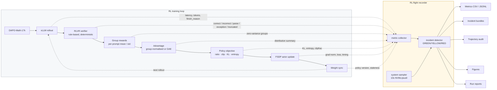
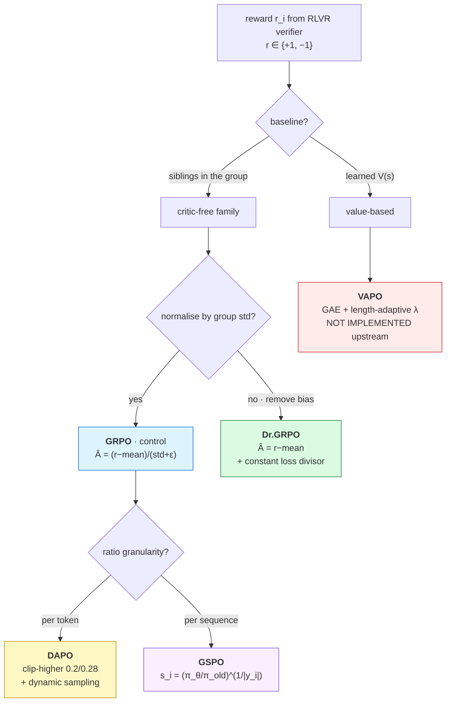

<div align="center">

# Qwen3-8B RL Systems Lab

### Five policy-optimization algorithms under one instrumented pipeline

#### *because a reward curve is not ground truth*

[](https://huggingface.co/Qwen/Qwen3-8B)
[](https://github.com/verl-project/verl)
[](docs/algorithm_matrix.md)
[](docs/hardware_environment.md)
[](manifests/versions.txt)
[](analysis/VERIFIER_GATE_REPORT.md)

[](analysis/PRE_RL_GATE_REPORT.md)
[](analysis/VERIFIER_GATE_REPORT.md)
[](analysis/R0_smoke_report.md)
[](docs/observability/architecture.md)
[](manifests/hardware.txt)
[](analysis/incident_log.md)

</div>

---

This repository is an **instrumented study of reinforcement learning for Qwen3-8B**,
not a collection of training scripts.

The central question:

> When an RL run improves, stalls, or collapses, can we explain the change from the
> underlying rollout, reward, policy-update, and systems signals?

A higher reward number is not the deliverable. The deliverable is being able to say
*why* the number moved — and, just as often, to show that it moved for a reason that has
nothing to do with the policy at all.

**Stack:** Qwen3-8B · VeRL · DAPO-Math-17k · RLVR · GRPO / Dr.GRPO / DAPO / GSPO / VAPO · 4×H20 NVLink

> **Scope.** Everything here is a **GRPO systems pilot / rehearsal** applied directly to
> the released post-trained `Qwen/Qwen3-8B`. It is **not** the `M3` checkpoint of the
> author's medical paper, whose design is `Qwen3-8B → SFT (M1) → DPO (M2) → GRPO (M3)`.
> No result here may be presented as that M3.

---

## Research Question

RL training failures are routinely misattributed. A reward curve that falls looks the
same whether the policy degraded, the verifier stopped parsing, the length cap truncated
every answer, or a batch happened to contain unsolvable prompts. The reward curve alone
cannot tell these apart.

This lab is built on the premise that **`reward` is an output of a pipeline, not ground
truth**, and instruments every stage so each hypothesis can be falsified independently.

**This has already paid off before a single long run:** the pre-RL rollout showed reward
−0.746 at 12.7% accuracy, which reads as a weak policy. It was not. **Only 2 of 512
samples were genuinely wrong answers** — 87% were truncated mid-reasoning. Raising the
length budget moved accuracy 12.7% → 56.25% with *identical weights*.

---

## System Architecture



The recorder **observes, records, derives, alerts and captures evidence. It never
trains.** It cannot modify reward, advantage, optimizer state, learning rate, KL
coefficient, `rollout.n` or batch size.

---

## Experimental Program

### Policy-optimization comparison suite

Five methods, studied as **interventions on specific pipeline layers** — not as five
trainers racing for reward. Full detail: [`docs/algorithm_matrix.md`](docs/algorithm_matrix.md).

| Algorithm | Optimization unit | Critic | Core intervention | Primary diagnostic question |
|---|---|---|---|---|
| **GRPO** — control | token ratio, group-normalised advantage | no | — (baseline) | What do real GRPO dynamics look like, and how much of the batch carries gradient? |
| **Dr.GRPO** — bias correction | token ratio, **mean-only** advantage | no | removes group-**std** and per-sequence **length** normalization | How much of GRPO's response-length growth is optimization bias rather than reasoning? |
| **DAPO** — group-signal engineering | token ratio | no | clip-higher · dynamic sampling · token-level PG · overlong shaping | What do dynamic sampling and asymmetric clipping actually change, and at what token cost? |
| **GSPO** — sequence-level | **sequence ratio** (length-normalised) | no | clipping decided per sequence, not per token | Do a few extreme token ratios dominate clipping, and does GSPO suppress that? |
| **VAPO** — cross-paradigm | token ratio, **GAE** | **yes** | brings the value function back | Does a critic give better credit assignment on long CoT, and at what cost? |

| Run | Purpose | Status |
|---|---|---|
| **R0** | GRPO smoke — prove one update's data flow end to end | ✅ **PASS** |
| **R1** | Vanilla GRPO baseline — the control | 🔜 next |
| **R2** | DAPO, matched budget | 📋 planned |
| **R_dr_grpo** | Dr.GRPO bias correction | 📋 planned |
| **R_gspo** | GSPO sequence-level ratio | 📋 planned |
| **R_vapo** | VAPO — **not implemented upstream**, feasibility only | 🚧 [feasibility report](analysis/vapo_feasibility.md) |
| **R3-A/B/C** | Failure injection: truncation · excessive LR · verifier timeout | 📋 planned |

Budget discipline: every algorithm gets a **2-update smoke test**, then a **20-update short
run**, and only then 50–150 updates *if its dynamics prove worth the GPU-hours*.
Comparisons are matched on **generated-token budget**, not just optimizer updates, because
dynamic sampling makes "100 updates" a non-comparable unit across arms.

---

---

## Algorithm Deep Dive

Each method changes **one specific layer**. The formulas below are the intervention; the
per-algorithm notes carry the source citations, the measured evidence and the falsification
plan.



### GRPO — the control · [notes](docs/algorithms/grpo.md)

Token-level ratio, group-normalised outcome advantage broadcast to every token:

$$
\mathcal{J}_{\text{GRPO}}=\mathbb{E}\left[\frac{1}{G}\sum_{i=1}^{G}\frac{1}{|y_i|}\sum_{t=1}^{|y_i|}\min\Big(\rho_{i,t}\hat A_i,\ \mathrm{clip}(\rho_{i,t},1-\epsilon,1+\epsilon)\hat A_i\Big)\right],
\qquad
\hat A_i=\frac{r_i-\mathrm{mean}(\mathbf r)}{\mathrm{std}(\mathbf r)+\varepsilon}
$$

**Measured here:** verl uses the *unbiased* $(n{-}1)$ std, which makes the advantage extrema a
direct readout of group composition. R1 ($G=8$) logged exactly `2.4749 / 1.6202 / 1.2076` —
the $k=1,2,3$ correct-of-8 cases:

$$
\lvert\hat A\rvert_{k=1}=\frac{1.75}{\sqrt{0.5}}=2.4749,\qquad
\lvert\hat A\rvert_{k=2}=\frac{1.5}{0.9258}=1.6202,\qquad
\lvert\hat A\rvert_{k=3}=\frac{1.25}{1.0351}=1.2076
$$

When a group is unanimous, $\mathrm{std}=0$ **and** $r_i-\mathrm{mean}=0$, so
$\hat A_i=0$ — that prompt contributes *no gradient at all*. Tracked as
`effective_signal_fraction`; R1 measured **63.75%** overall.

### Dr.GRPO — bias correction · [notes](docs/algorithms/dr_grpo.md)

Removes **two** biases independently, so it is one experiment with two falsifiable claims:

$$
\underbrace{\hat A_i=\frac{r_i-\mathrm{mean}(\mathbf r)}{\mathrm{std}(\mathbf r)+\varepsilon}\ \longrightarrow\ r_i-\mathrm{mean}(\mathbf r)}_{\text{bias 1: difficulty re-weighting}}
\qquad
\underbrace{\frac{1}{\lvert y_i\rvert}\sum_t \ell_{i,t}\ \longrightarrow\ \frac{1}{C}\sum_t \ell_{i,t}}_{\text{bias 2: length}}
$$

Bias 2 is the sharp one: dividing by $\lvert y_i\rvert$ makes a long wrong answer's *per-token*
penalty $1/\lvert y_i\rvert$ as large as a short one's, so padding a failure dilutes its
gradient. A constant divisor $C$ removes the incentive.

### DAPO — group-signal engineering · [notes](docs/algorithms/dapo.md)

Four mechanisms. Asymmetric clipping, so low-probability tokens get absolute headroom:

$$
\min\Big(\rho\hat A,\ \mathrm{clip}\big(\rho,1-\epsilon_{\text{low}},1+\epsilon_{\text{high}}\big)\hat A\Big),\qquad \epsilon_{\text{low}}=0.2,\ \epsilon_{\text{high}}=0.28
$$

Dynamic sampling keeps only groups that actually carry signal, $0\lt \lvert\{i:r_i=1\}\rvert\lt G$,
and regenerates the rest. Token-level aggregation divides by the batch token total
$\sum_i\lvert y_i\rvert$. Overlong shaping replaces the truncation cliff with a linear ramp
(verbatim from `reward_manager/dapo.py:126`):

$$
R_{\text{overlong}}(y)=\min\!\left(-\frac{\lvert y\rvert-(L_{\max}-L_{\text{buf}})}{L_{\text{buf}}}\cdot\alpha,\ 0\right)
$$

### GSPO — sequence-level · [notes](docs/algorithms/gspo.md)

Moves the ratio, and therefore the **clipping decision**, from token to sequence — the
length-normalised geometric mean of token ratios:

$$
s_i(\theta)=\left(\frac{\pi_\theta(y_i\mid x)}{\pi_{\theta_{\text{old}}}(y_i\mid x)}\right)^{1/\lvert y_i\rvert}=\exp\!\left(\frac{1}{\lvert y_i\rvert}\sum_{t=1}^{\lvert y_i\rvert}\log\frac{\pi_\theta(y_{i,t}\mid x,y_{i,\lt t})}{\pi_{\theta_{\text{old}}}(y_{i,t}\mid x,y_{i,\lt t})}\right)
$$

verl implements it natively (`core_algos.py:1546`) with a stop-gradient identity, so the
*value* is the sequence ratio while the *gradient* still flows per token:

$$
s_{i,t}(\theta)=\mathrm{sg}\big[s_i(\theta)\big]\cdot\frac{\pi_\theta(y_{i,t})}{\mathrm{sg}\big[\pi_\theta(y_{i,t})\big]}
$$

> **Prerequisite, established by measurement.** R0 ran $\rho\equiv1$ exactly
> (`mini == train`), making clipping structurally zero. R1 fixed that (`8 < 16`) and got
> $\rho\neq1$ — but clip fraction is only **1.5e-4**, so $\rho\approx1$ still. **A GSPO arm at
> lr 1e-6 would compare two ratios that are both ≈1.** It needs a larger `train/mini` ratio
> or a higher LR to have anything to measure.

### VAPO — cross-paradigm · [notes](docs/algorithms/vapo.md) · [feasibility](analysis/vapo_feasibility.md)

The only arm that replaces the sibling baseline with a learned value function, giving
per-token credit instead of one scalar per response:

$$
\delta_t=r_t+\gamma V(s_{t+1})-V(s_t),\qquad
\hat A_t^{\text{GAE}(\gamma,\lambda)}=\sum_{l=0}^{T-t-1}(\gamma\lambda)^l\delta_{t+l}
$$

The effective credit horizon is $\approx 1/(1-\gamma\lambda)$, so at fixed $\lambda$ credit
decays geometrically and early tokens of a long chain of thought get almost nothing. VAPO's
contribution is making $\lambda$ scale with $\lvert y\rvert$ — and **that is precisely the
piece with no implementation** in verl or verl-recipe.

---

## Observability Stack

| Layer | Signals recorded | Failure modes it separates |
|---|---|---|
| **Rollout** | latency, tokens, `finish_reason`, length distribution, truncation rate | truncation contamination, length explosion, KV-cache pressure |
| **Verifier** | `OK_CORRECT` / `OK_INCORRECT` / `PARSE_FAILURE` / `VERIFIER_EXCEPTION` / `TRUNCATED`, latency p50/p95 | parse failure vs wrong answer vs verifier crash |
| **Group signal** | group mean/std, all-correct, all-wrong, mixed, zero-std, **effective signal fraction** | dataset too easy / too hard, effective-batch collapse |
| **Advantage** | mean, std, min, max, non-finite detection | zero-advantage batches, heavy tails |
| **Policy update** | KL, entropy, clip fraction (low/high), grad norm, policy loss | instability, entropy collapse, trust-region saturation |
| **Provenance** | rollout policy version, consuming step, **staleness**, rollout↔train prob correlation | stale rollouts invalidating the importance ratio |
| **Value** *(critic arms)* | value/return mean·std, explained variance, value loss, per-length-bucket value error | value bias and credit decay on long CoT |
| **Systems** | per-stage wall time and share, GPU util/mem/temp/power, CPU, RAM, disk | *why* GPU utilization is low, not merely that it is |

Definitions and the real VeRL key behind each metric:
[`docs/observability/metric_dictionary.md`](docs/observability/metric_dictionary.md).

**Metrics the current VeRL build does not emit are recorded as `unavailable`, never as
`0`.** A zero and a missing measurement mean different things.

---

## Current Status

<!-- STATUS_START -->
| Stage | Status |
|---|---|
| Infrastructure validation | **PASS** |
| CUDA 13 / torch 2.11 stack | **PASS** |
| Qwen3-8B via vLLM 0.24 | **PASS** |
| 4-GPU NCCL (349.8 GB/s busBW) | **PASS** |
| RLVR verifier gate | **PASS** |
| Flight recorder | **ACTIVE** |
| R0 — GRPO smoke | **IN PROGRESS** |
| R1 — Vanilla GRPO | **NOT RUN** |
| R2 — DAPO | **NOT RUN** |
| R3 — Failure injection | **NOT RUN** |

**Live run** `E_drgrpo_scaled` · step **8** ·
health **YELLOW** · reward 0.0312 ·
KL 0.00000 · entropy 0.2786 ·
effective signal 0.62 ·
incidents 2

_Auto-updated 2026-09-11T19:49:55 by `scripts/monitoring/github_sync.py`. Full status: [`status/latest.md`](status/latest.md)._
<!-- STATUS_END -->

The status block above is the only region of this file written automatically
(by [`scripts/monitoring/github_sync.py`](scripts/monitoring/github_sync.py)).

---

## Latest Diagnostics — R1 vanilla GRPO, 20 updates

Full analysis: [`analysis/R1_baseline_report.md`](analysis/R1_baseline_report.md) ·
figures: [`experiments/R1_grpo_baseline/figures`](experiments/R1_grpo_baseline/figures)

| quantity | R1 result |
|---|---|
| optimizer updates | **20 / 20**, launcher exit 0, ~30 min on 4xH20 |
| rollouts | **2560** (320 distinct prompts x G=8) |
| `actor/pg_clipfrac` | **5.07e-5 - 2.61e-4** (mean 1.54e-4) - nonzero but ~0.015% of tokens |
| `actor/ppo_kl` | **-5.44e-5 ... +4.02e-5**, signed |
| `actor/kl_loss` | monotone **1e-4 -> 2.4e-3** - real drift from the reference |
| `critic/advantages/max` | **2.4749 / 1.6202 / 1.2076** - the k=1,2,3 of 8 cases exactly |
| effective signal groups | **63.75%** overall |
| validation accuracy | **49.5%** @10 -> **48.5%** @20 |
| `response_length/mean` | oscillates **1192 - 2188**, no monotone trend |
| `entropy` | **0.2255 - 0.4432**, no collapse |
| configured-cap hits | **5 / 2560 (0.20%)** - the 8192 budget is adequate |
| policy staleness / rollout-vs-train prob corr | **0** / **0.9994 - 0.9997** |

**What R1 does and does not establish.** It establishes a working, non-degenerate GRPO
control: clipping and signed KL are nonzero, within-group reward variation persists, and
there is no entropy or length collapse. **It does not establish a generalization
improvement** - validation moved 49.5% -> 48.5%, and no pre-training validation was run
under this exact configuration, so there is no baseline to compare against. Three detector
warnings and an exit-phase traceback have root causes marked **PENDING**, not guessed.

**Two of my own metric mappings were wrong and are corrected** (INC-005): VeRL's
`response_length/clip_ratio` compares against the *padded tensor width*
(`metric_utils.py:460`), not the configured cap, so it was never a truncation rate; and
`pg_clipfrac` / `pg_clipfrac_lower` are *either-sign clipping* and the *dual-clip branch*,
not upper/lower clipping - summing them was meaningless. The affected claim in the R0 report
carries an inline correction rather than a silent edit.


## Engineering Findings

Only facts supported by a measurement in this repository.

| Finding | Evidence | Reference |
|---|---|---|
| Current VeRL pins a CUDA-13 world (`torch 2.11.0+cu130`, `vLLM 0.24.0`, `flash-attn 2.8.3`) incompatible with the node's ambient `torch 2.8.0+cu128`; an isolated uv venv resolves it without touching the base install | 5 runtime gates: BF16, imports, FlashAttention sm90 (max abs diff vs SDPA 0.0078), 4-rank NCCL 349.8 GB/s, vLLM generation | [gate report](analysis/PRE_RL_GATE_REPORT.md) |
| **DAPO-Math-17k ships 1,791,700 rows but only 17,917 unique prompts — each repeated exactly 100×** | `min repeats = max repeats = 100` over distinct `extra_info.index` | [dataset manifest](manifests/dataset.md) |
| All 17,917 ground truths are **plain integers**, so symbolic-equivalence verification buys little here | format classification over the deduplicated answer set | [verifier test](analysis/verifier_unit_test.md) |
| The `math_dapo` verifier scores **+1.0 / −1.0** and maps *unparseable* to the same −1.0 as *wrong* | 440 constructed cases | [verifier semantics](analysis/verifier_semantics.md) |
| The verifier inspects only the **last 300 characters** (boxed fallback: last 100); correct answers beyond that score −1.0 | 0/40 constructed survived; 6.05% incidence in 512 real rollouts | [verifier semantics](analysis/verifier_semantics.md) |
| **Qwen3-8B thinking mode makes `max_response_length=4096` unusable: 87.1% truncation, 79.7% zero-variance groups — yet only 2/512 samples were genuinely wrong answers** | 512-sample fixed-policy rollout; length median exactly on the cap | [reward distribution](analysis/pre_rl_reward_distribution.md) |
| Raising the length budget moved accuracy **12.7% → 56.25%** with identical weights; disabling thinking gave the best *gradient signal per token* (43.75% mixed groups at 1/6 the tokens) | two-arm length probe, same prompts and verifier | [reward distribution](analysis/pre_rl_reward_distribution.md) |
| GRPO advantages are **±1.5** because `torch.std` is the unbiased (n−1) estimator — the exact term Dr.GRPO argues is a bias | R0 measured extrema match the source arithmetic | [R0 report](analysis/R0_smoke_report.md) |
| Policy staleness is **exactly 0** and rollout↔training prob correlation **0.9996** — synchronous GRPO and correct weight sync, measured not assumed | VeRL native `trajectory_staleness`, `rollout_actor_probs_pearson_corr` | [R0 report](analysis/R0_smoke_report.md) |
| Verifier cost is negligible (0.017 ms mean, 0% exceptions), so it can be excluded as a throughput bottleneck by inspection | 440 cases + 512 rollouts | [verifier test](analysis/verifier_unit_test.md) |
| **Two of my own metric mappings were wrong**: `response_length/clip_ratio` compares against the padded tensor width, not the configured cap, so it was never a truncation rate; `pg_clipfrac`/`pg_clipfrac_lower` are either-sign clipping and the dual-clip branch, not upper/lower | `metric_utils.py:460`; R0's own step 1 logged clip_ratio 0.03125 with max 3509 against a 4096 cap | [INC-005](analysis/incident_log.md) |
| GRPO advantage extrema are a **free readout of group composition** — no extra instrumentation needed | R1 (G=8) logged exactly 2.4749 / 1.6202 / 1.2076, matching k=1,2,3 correct-of-8 under the unbiased (n−1) std | [grpo notes](docs/algorithms/grpo.md) |
| **A near-zero `ppo_kl` does NOT mean ρ≈1** — it is a *signed* mean, so opposite deviations cancel. Measuring the distribution directly overturned an earlier conclusion drawn from it | `ppo_kl` flips sign across consecutive updates (+5.1e-5, −4.9e-5, +3.1e-5) while \|ρ−1\| p99 = 0.055 and max = 0.42; **8% of tokens deviate beyond 1%** | [ratio distribution](analysis/ratio_distribution.md) |
| Clip-Higher has little to act on — but because the **band is narrow**, not because ρ is tight: only 0.05% of tokens deviate beyond 20%, and (1.2, 1.28] is a slice of that | R2 `pg_clipfrac` 5.2e-5→7.3e-5 when the upper clip moved 0.2→0.28 | [R1 vs R2](analysis/R1_vs_R2.md) |
| Vanilla GRPO showed **no runaway response-length growth** over 20 updates at lr 1e-6 — a null result that constrains when the Dr.GRPO bias can even be observed | R1 `response_length/mean` oscillated 1192–2188 with no monotone trend | [dr.grpo notes](docs/algorithms/dr_grpo.md) |
| The 8192-token budget **resolved the truncation contamination**: 5 of 2560 rollouts hit the cap | R1 configured-cap hits 0.20%, versus 87.11% at think@4096 | [R1 report](analysis/R1_baseline_report.md) |
| Four infrastructure faults presented as something they were not | INC-001 split-routed proxy · INC-002 git subprocess proxy · INC-003 `uv --frozen` ignores `UV_DEFAULT_INDEX` (0.1 → 46.6 MB/s, ~460×) · INC-004 a `TypeError` disguised as a vLLM engine crash | [incident log](analysis/incident_log.md) |

---

## Failure Taxonomy

| Family | Instances observed so far |
|---|---|
| **Data** | 100× prompt repetition; duplicate prompts within a batch double-weight in GRPO |
| **Reward / verifier** | parse failure scored as wrong answer; 300-char extraction window; trailing-period false negative (dormant) |
| **Policy** | none observed yet |
| **Optimization** | none observed yet |
| **Rollout** | truncation contamination at 87.1% — the dominant pre-R0 finding |
| **Infrastructure** | INC-001 … INC-004, plus two silent observability defects found by R0 |

A single symptom — "reward went down" — can originate in any of these. That is why the
others are instrumented.

---

> **踩过的每一个坑都记在 [`analysis/BUG_LOG.md`](analysis/BUG_LOG.md) 里。**
> 20 条，按踩到的顺序。里面一半以上的坑，报错信息指的地方跟真正的问题不是一回事 ——
> `flash-attn` 装不上其实是网络路由，`MPClient` 崩了其实是我自己的 TypeError，
> 「模型很差」其实是长度上限。

---

## Reproducibility Contract

Every run records: run id, VeRL commit, model revision, dataset SHA, seed, fully resolved
config, hardware snapshot, environment lock, checkpoint ids, and restart boundaries.

- **Restarted runs are never stitched into one curve** — every restart leaves a visible
  `RESTART` marker.
- **Every figure is regenerable** from the committed CSVs by
  [`scripts/monitoring/plot_live_metrics.py`](scripts/monitoring/plot_live_metrics.py).
- **Raw traces are always plotted** alongside any smoothed overlay.
- Weights, optimizer state, datasets, HF cache and full rollout dumps are **not** committed.
- `uv.lock` is locally modified to retarget PyPI URLs to a fast mirror; versions and all
  1413 sha256 hashes are unchanged and still verified (INC-003).

---

## Repository Map

```
docs/
  algorithm_matrix.md       the five-algorithm comparison design
  algorithms/               grpo · dr_grpo · dapo · gspo · vapo — formulas,
                            source citations, measured evidence
  experiment_plan.md        stage gates, run definitions, checkpoint policy
  rl_pipeline_notes.md      official Qwen3-8B GRPO config, read from source
  debugging_playbook.md     reward-is-not-ground-truth checklist
  hardware_environment.md   measured hardware and interconnect
  observability/            architecture, metric dictionary, incident taxonomy,
                            diagnosis playbook
scripts/
  monitoring/               the flight recorder
  evaluation/               verifier unit test, fixed-policy rollout, length probe
  data/                     dataset preparation (dedup, splits)
  training/                 run_with_observer.sh, per-run launchers
configs/                    grpo · dr_grpo · dapo · gspo · vapo · failure_injection
analysis/                   source traces, verifier reports, incident log, gate reports
  BUG_LOG.md                踩坑记录 —— 所有踩过的坑，按顺序，口语流水账
experiments/<RUN_ID>/       telemetry, metrics, trajectories, incidents, figures,
                            run_manifest.json, RUN_REPORT.md
manifests/                  hardware, versions, dataset, model, pip freeze
status/                     live run status
```

---

## Citation / Acknowledgements

- **VeRL** — [verl-project/verl](https://github.com/verl-project/verl) (commit `1252cc71`)
- **Qwen3** — [Qwen/Qwen3-8B](https://huggingface.co/Qwen/Qwen3-8B)
- **DAPO** — [BytedTsinghua-SIA/DAPO](https://github.com/BytedTsinghua-SIA/DAPO)
- **Dr.GRPO** — [arXiv 2503.20783](https://arxiv.org/pdf/2503.20783)
- **GSPO** — [arXiv 2507.18071](https://arxiv.org/pdf/2507.18071)
- **VAPO** — [arXiv 2504.05118](https://arxiv.org/pdf/2504.05118)

This lab reproduces official implementations rather than reimplementing them; any
deviation is documented and justified in `analysis/`.

---

<div align="center">

## 关于作者

</div>

<table>
<tr>
<td width="120" align="center">
<a href="https://github.com/terrense">

</a>
</td>
<td>

### **terrense** &nbsp;·&nbsp; [](https://github.com/terrense)

这个仓库的作者和唯一维护者。

**在做的方向** —— 大模型强化学习的系统工程与失败分析，以及机器人/农业场景的仿真与控制。

这个 lab 的来历：正在写的医学方向论文需要一条完整的
`Qwen3-8B → SFT (M1) → DPO (M2) → GRPO (M3)` 后训练链路。在正式跑 M3 之前，
我想先把 GRPO 这一环的**系统行为**彻底搞明白 —— 所以有了这个仓库。
它是那条链路的预演，不是论文里的正式实验。

真正想解决的问题不是"怎么把 reward 调高"，而是：

> **当一次 RL 训练变好、卡住或者崩掉的时候，我能不能从 rollout、reward、
> 策略更新和系统信号里，把原因说清楚。**

这个问题在这个项目里被验证过一次，代价很小但很典型：预训练前的 rollout 显示
reward −0.746、准确率 12.7%，看着就是模型不行 —— 结果 512 条里只有 2 条是真答错，
87% 是被长度上限截断的。同一份权重，只把长度预算放开，准确率直接到 56.25%。

从那以后，这个仓库里所有结论都必须能追到具体的 step、metric、源码行号或者
[踩坑记录](analysis/BUG_LOG.md)里的某一条。

</td>
</tr>
</table>

**联系** —— 有问题或者想讨论，直接开 [issue](https://github.com/terrense/qwen3-8b-grpo-dapo-lab/issues)。

