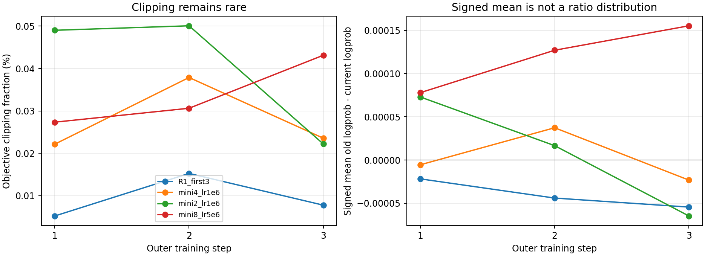

# Ratio sensitivity probe：三臂结果与审计

三臂均完成 3 个外层训练 step，driver 记录 exit 0，最后一臂日志结束于 2026-09-10 19:21 左右。减小 mini batch 后 clipping 统计量增加，但峰值仍仅 **0.0501%**；没有达到原脚本自定的 1% 目标。不能据此宣布 clip-higher 无效、GSPO 不可测，或自动决定加大学习率重跑。

## 对齐后的结果

R1 只取前 3 步，避免把 20 步基线与 3 步探测混比。下表均为逐 step 指标的算术平均或最大值；不是对全部 token 重新加权的统计量。每个外层 step 的 mini batch 数为 2 / 4 / 8 / 2，区别于每臂的外层 step 数 3。

| 臂 | mini | LR | mean clip (%) | max clip (%) | max abs(signed ppo_kl) | actor 秒/步 | total 秒/步 |
|---|---:|---:|---:|---:|---:|---:|---:|
| R1_first3 | 8 | 1e-6 | 0.00941 | 0.01525 | 5.44359e-05 | 31.16 | 102.06 |
| mini4_lr1e6 | 4 | 1e-6 | 0.02787 | 0.03789 | 3.73269e-05 | 33.49 | 105.90 |
| mini2_lr1e6 | 2 | 1e-6 | 0.04044 | 0.05008 | 7.29226e-05 | 34.18 | 99.67 |
| mini8_lr5e6 | 8 | 5e-6 | 0.03370 | 0.04314 | 0.000155259 | 31.43 | 96.94 |

mini4 / mini2 的 mean clip 分别约为 R1 前三步的 2.96 / 4.30 倍，LR×5 臂约为 3.58 倍。actor 时间相对约增加 7.5% / 9.7% / 0.9%。只有三步、无重复种子，且生成长度不同，这些是本次观测，不能外推稳定吞吐或因果效应。总 step 时间包含首步开销，不应称为稳态时间。三臂 step 时间合计约 907.5 秒，按每小时 40 元折合约 10.08 元；这不含启动、空闲和其他作业，**不是账单总额**。

## 可比性与边界

- 固定 train_batch_size=16、rollout.n=8、max_response_length=8192、clip=0.2/0.2、GRPO、KL loss coefficient=0.001。每臂从原始模型启动，无断点恢复。具体启动参数见审计 JSON。
- 按 prompt 文本 SHA256 核对，三臂每一步的 16 个 prompt 集合均与 R1 对应步一致。每臂共 384 条保存的 response，48 个 group；每组 8 条。相同 prompt 不代表相同 rollout，第一步 reward 已有差异，不能称为严格配对生成样本实验。
- 总 response token 数：R1 前三步 642890；mini4 673469；mini2 651394；LR×5 651568。因此这是固定 prompt/step 数的探测，未实现相同 token 预算。
- 已保存数值指标无非有限值，staleness 最大值 0。三臂 native response_length/max 均低于 8192；没有观察到该长度上限命中。精确 finish_reason 未保存，不能恢复全部终止原因。
- 验证集评估、checkpoint、长期稳定性、真实数学正确率复核、GSPO、额外 R1/R2 正式重跑：**NOT RUN**。不以 reward 均值给各臂排性能名次。

## 修正 ratio 的解释

本 checkout 的 `verl/trainer/ppo/core_algos.py` 中，vanilla PPO 的 `ppo_kl` 是 masked mean(old_log_prob - log_prob)，实现还对差值作 clamp。它是有符号的样本统计量，正负可以抵消，不能由其接近零推出每个 token 的 ratio 接近 1，更不能断言 ratio 恒在 1.00002 附近。

`pg_clipfrac` 统计 `pg_losses2 > pg_losses1` 的目标函数 clipping 激活比例，取决于 advantage 符号；它不等于所有 token 落在 ratio 区间外的比例。`pg_clipfrac_lower` 在这里是 dual-clip 分支，不是普通 ratio 下尾概率。

所以现有证据支持的是“保存的目标 clipping 激活很少”，而不是“token 与 sequence ratio 都恒等于 1”。原脚本的 1% / 1e-3 判据只是启发式目标，不是算法有效性的必要条件。提高 LR 去追这个数字并非充分的实验设计。

## 记录缺口与退出异常

这次 `scripts/evaluation/ratio_probe.sh` 直接调用训练入口，绕过 `run_with_observer.sh`。因此缺少该流程应有的 flight recorder、完整系统时间序列和运行时 manifest。这里的证据目录是**事后复制的原始 metric sink**，审计 JSON 是事后解析，不能冒充当时的 recorder 或 resolved config。

三臂末尾均有 DataLoader/weakref 清理相关 traceback；driver 同时记录 exit 0，指标完整到 step 3。按“完成并有退出清理异常”记录，不改成无异常 PASS。**root cause: PENDING**；未据此重启、安装依赖或修改环境。

## 下一次付费运行前的具体方案

先补只读诊断：按 optimizer mini step 记录 masked log-ratio 的分位数和绝对偏移、ratio 上下尾比例、按 advantage 正负分层的 clipping 激活数及分母，并计算同一条 response 的 mean log-ratio / sequence ratio。聚合必须说明 token 与 sequence 权重，不能平均各 GPU 分位数冒充全局分位数。保留聚合所需的计数或直方图，并记录模型版本与实际 optimizer step。

在 CPU 上以已知 ratio 和正负 advantage 的合成输入验证这些统计量与 clipping 分支，再通过 flight recorder 运行一臂短探测。第一轮建议沿用原 baseline 超参，避免为了统计目标继续抬高 LR；新增 GPU 运行、预算和重复数待用户决定。**上述新诊断尚未实现，新探测 NOT RUN**。不自动启动两个 20-step 重跑。

## 可复核证据

- [原始三臂汇总](ratio_probe.jsonl)
- [事后审计：逐步指标、prompt 对齐、启动参数与 hash](ratio_probe_audit.json)
- [保存的 native metric sink](evidence/ratio_probe/)；[SHA256](evidence/ratio_probe/SHA256.json)
- 服务器保留 `logs/ratio_probe_driver.log`、`logs/probe_*_metrics.jsonl`、`logs/probe_*.log` 与 `logs/probe_*_dump/`，未改写。
