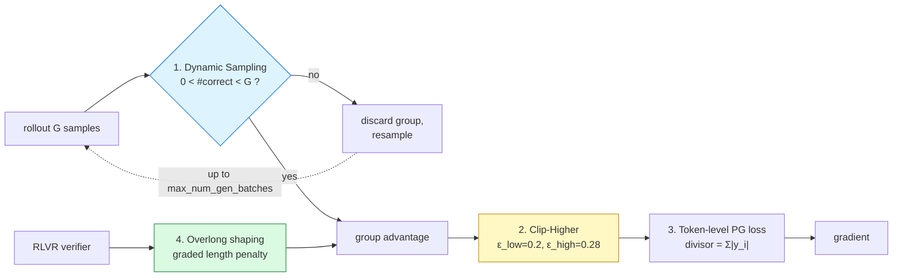

# DAPO — group-signal and clipping engineering

*Decoupled Clip and Dynamic sAmpling Policy Optimization* —
[BytedTsinghua-SIA/DAPO](https://github.com/BytedTsinghua-SIA/DAPO)

**Status: PLANNED.** No DAPO run has executed.

Recipe in this checkout: `repos/verl-recipe/dapo/` (`main_dapo.py`, `dapo_ray_trainer.py`).
Defaults below are read from `run_dapo_qwen2.5_32b.sh`, and the overlong formula from
`repos/verl/verl/workers/reward_manager/dapo.py:123-130`.

Four independent mechanisms — they should be ablated separately, because they act on
different layers.



---

## 1. Clip-Higher — asymmetric trust region

$$
\min\Big(\rho_{i,t}\hat A_i,\ \operatorname{clip}\big(\rho_{i,t},\,1-\epsilon_{\text{low}},\,1+\epsilon_{\text{high}}\big)\hat A_i\Big),
\qquad \epsilon_{\text{low}}=0.2,\ \ \epsilon_{\text{high}}=0.28
$$

**Why asymmetry matters.** For a token with low current probability $\pi_\theta=0.01$, the
symmetric upper bound $1+\epsilon=1.2$ caps it at $0.012$ — an absolute gain of $0.002$. A
high-probability token at $0.9$ may rise to $1.08$ (clipped at 1). The *same* ratio bound
gives vastly different absolute headroom, so rare-but-good tokens are structurally
suppressed and the policy collapses toward its existing modes. Raising only the upper bound
gives low-probability tokens more room and **slows entropy collapse**.

Also set: `clip_ratio_c=10.0` (dual-clip guard for large negative advantages).

**Expected signature:** `clip_fraction_high` becomes the dominant clip term; entropy decays
more slowly than the GRPO control.

---

## 2. Dynamic Sampling — restoring the effective batch

Keep only groups that are *not* unanimous:

$$
0<\Big|\{\,i:\ r_i=1\,\}\Big|<G
$$

Unanimous groups have $\operatorname{std}(\mathbf r)=0$, hence $\hat A_i\equiv 0$ and **zero
gradient**. DAPO discards them and regenerates, up to `max_num_gen_batches=10` attempts, so
the *nominal* batch and the *effective* batch coincide.

```
algorithm.filter_groups.enable=True
algorithm.filter_groups.metric=acc
algorithm.filter_groups.max_num_gen_batches=10
```

**This is the direct attack on the metric this lab already measures.** Baselines so far:

| run | zero-std group ratio | effective signal fraction |
|---|---|---|
| pre-RL rollout, think@4096 | 79.69% | 20.31% |
| R0 update 1 | 50.0% | 50.0% |
| R0 update 2 | 37.5% | 62.5% |

**The cost is real and must be reported**, not hidden: discarded groups still consumed full
rollout compute. Required columns — `discarded_groups`, `resampling_rounds`,
`generated_tokens`, `effective_batch` — which is exactly why the comparison protocol matches
on **generated-token budget**, not optimizer updates.

---

## 3. Token-level Policy Gradient Loss

$$
\mathcal{L}^{\text{GRPO}}=\frac{1}{G}\sum_{i}\frac{1}{\lvert y_i\rvert}\sum_{t}\ell_{i,t}
\qquad\longrightarrow\qquad
\mathcal{L}^{\text{DAPO}}=\frac{1}{\sum_{i}\lvert y_i\rvert}\sum_{i}\sum_{t}\ell_{i,t}
$$

Every token carries equal weight, so long sequences contribute in proportion to their length
instead of being averaged down to one sequence-worth of signal. Config: `loss_agg_mode=token-mean`.

> Note this addresses the *same* length pathology as Dr.GRPO, by a **different route**:
> Dr.GRPO normalises by a fixed constant $C$; DAPO normalises by the batch token total
> $\sum_i\lvert y_i\rvert$. Both remove the per-sequence $1/\lvert y_i\rvert$ divisor. Running
> both arms separates "does removing the divisor help" from "does the specific replacement matter".

---

## 4. Overlong Reward Shaping

Instead of a cliff at truncation, a **graded** penalty inside a soft buffer. Verbatim from
`reward_manager/dapo.py:123-126`:

```python
expected_len   = max_resp_len - overlong_buffer_len
exceed_len     = valid_response_length - expected_len
overlong_reward = min(-exceed_len / overlong_buffer_len * penalty_factor, 0)
reward += overlong_reward
```

i.e. with $L_{\max}$ the cap, $L_{\text{buf}}$ the buffer and $\alpha$ the penalty factor:

$$
R_{\text{overlong}}(y)=\min\!\left(-\frac{\lvert y\rvert-\big(L_{\max}-L_{\text{buf}}\big)}{L_{\text{buf}}}\cdot\alpha,\ \ 0\right)
$$

A linear ramp from $0$ to $-\alpha$ across the buffer. With
$L_{\max}=20480$, $L_{\text{buf}}=4096$, $\alpha=1.0$:

| $\lvert y\rvert$ | penalty |
|---|---|
| ≤ 16384 | 0 |
| 17408 | −0.25 |
| 18432 | −0.50 |
| 20480 | −1.00 |

**Why this matters for this project specifically.** The pre-RL rollout showed a hard cap
turns a *correct-but-unfinished* answer into a $-1.0$ indistinguishable from a wrong answer —
87.1% of samples. A graded penalty at least makes length pressure continuous and legible
instead of a discontinuity that silently corrupts the reward signal.

---

## DAPO removes KL entirely

```
use_kl_in_reward=False   kl_coef=0.0
use_kl_loss=False        kl_loss_coef=0.0
```

**This is a fifth difference from the GRPO control** (which uses `kl_loss_coef=0.001`), and it
moves the dynamics on its own — without a KL anchor the policy is free to drift from the
reference. Any GRPO↔DAPO comparison **must state whether KL was matched or removed.** The
honest options are to run DAPO faithfully (KL off, and say so) or to match KL and note the
deviation from the published recipe.

---

## Full reference config

```
algorithm.adv_estimator=grpo
actor_rollout_ref.actor.clip_ratio_low=0.2   clip_ratio_high=0.28   clip_ratio_c=10.0
algorithm.filter_groups.enable=True  metric=acc  max_num_gen_batches=10
actor_rollout_ref.actor.loss_agg_mode=token-mean
reward_model.overlong_buffer.enable=True  len=4096  penalty_factor=1.0
use_kl_in_reward=False  kl_coef=0.0  use_kl_loss=False  kl_loss_coef=0.0
train_prompt_bsz=512  n_resp_per_prompt=16  train_prompt_mini_bsz=32
max_response_length=20480  temperature=1.0  top_p=1.0
```

Note the reference recipe uses `mini_bsz=32 < prompt_bsz=512` → **16 gradient steps per
update**, so $\rho\neq1$ and clipping is genuinely active. Our R1 control uses `8 < 16` for
the same reason (see [`grpo.md`](grpo.md)).

Scaled to this node (4×H20), batch sizes come down; everything else is held at the reference
values.
