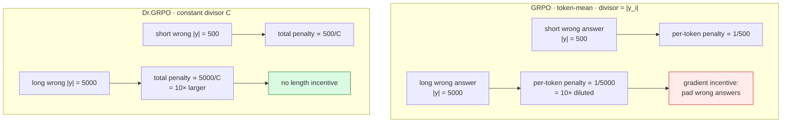

# Dr.GRPO — removing two optimization biases

*Understanding R1-Zero-Like Training: A Critical Perspective* —
[arXiv 2503.20783](https://arxiv.org/pdf/2503.20783)

**Status: PLANNED.** No Dr.GRPO run has executed.

The claim: GRPO contains optimization biases that inflate response length — **especially for
incorrect answers** — without improving reasoning. Dr.GRPO removes them. This is a
*bias-correction* arm, not a new objective.

Config per VeRL's own documentation (`repos/verl/docs/algo/grpo.md:53-62`) — not from a blog:

```
algorithm.norm_adv_by_std_in_grpo=False                        # bias 1
actor_rollout_ref.actor.loss_agg_mode=seq-mean-token-sum-norm  # bias 2
actor_rollout_ref.actor.loss_scale_factor=<constant>           # optional fixed divisor
actor_rollout_ref.actor.use_kl_loss=False
```

Two independent knobs → **two separately falsifiable claims**. They should be ablated
independently, not toggled together.

---

## Bias 1 — group-std normalization (difficulty bias)

GRPO divides by the group standard deviation:

$$
\hat{A}^{\text{GRPO}}_i=\frac{r_i-\mathrm{mean}(\mathbf{r})}{\mathrm{std}(\mathbf{r})+\varepsilon}
\qquad\longrightarrow\qquad
\hat{A}^{\text{Dr}}_i=r_i-\mathrm{mean}(\mathbf{r})
$$

With binary rewards the std is a **deterministic function of how many samples were correct**,
so dividing by it silently re-weights prompts by difficulty. For $G=4$, $r\in\{+1,-1\}$,
$k$ correct (verl uses the unbiased $n{-}1$ estimator):

| $k$ | mean | std | $\lvert\hat A^{\text{GRPO}}\rvert$ | $\lvert\hat A^{\text{Dr}}\rvert$ |
|---|---|---|---|---|
| 1 | −0.5 | 1.000 | **1.500** | 1.5 |
| 2 | 0.0 | 1.155 | **0.866** | 1.0 |
| 3 | +0.5 | 1.000 | **1.500** | 1.5 |

Under GRPO a 1-of-4 group pushes $\sqrt{3}\approx1.73\times$ harder than a 2-of-4 group —
purely because of group composition. Dr.GRPO flattens that to $1.5$ vs $1.0$.

> **This is not hypothetical here.** R0 measured `advantages/max = ±1.4999985`, which is
> exactly the $k\in\{1,3\}$ row. The baseline behaviour Dr.GRPO would remove has already
> been observed on this stack.

---

## Bias 2 — per-sequence length normalization (length bias)

GRPO's default `token-mean` divides each sequence's loss by **its own** token count:

$$
\mathcal{L}^{\text{GRPO}}=\frac{1}{G}\sum_{i=1}^{G}\frac{1}{\lvert y_i\rvert}\sum_{t=1}^{\lvert y_i\rvert}\ell_{i,t}
$$

Dr.GRPO replaces the per-sequence divisor with a **constant** $C$
(`seq-mean-token-sum-norm`, with `loss_scale_factor` = $C$, typically $L_{\max}$):

$$
\mathcal{L}^{\text{Dr}}=\frac{1}{G}\sum_{i=1}^{G}\frac{1}{C}\sum_{t=1}^{\lvert y_i\rvert}\ell_{i,t}
$$

### Why this inflates wrong answers

Consider a wrong response ($\hat A\lt 0$). Its total penalty under `token-mean` is

$$
\frac{1}{\lvert y_i\rvert}\sum_{t}\ell_{i,t}\ \propto\ \frac{\lvert y_i\rvert\cdot\bar\ell}{\lvert y_i\rvert}=\bar\ell
$$

— **independent of length**. Per *token*, a long wrong answer is penalised
$1/\lvert y_i\rvert$ as hard as a short one. Making a wrong answer longer dilutes the
per-token gradient, so the optimizer faces a gradient incentive to pad failures. With a
constant divisor $C$, total penalty scales with $\lvert y_i\rvert$ and the incentive disappears.



---

## The diagnostic question

> **How much of the response-length growth observed under GRPO is optimization bias rather
> than genuine reasoning improvement?**

Already measurable on this stack. R0 saw `response_length/mean` rise **1532 → 2041 tokens in
two updates**. Over R1's 20 updates the mean instead **oscillated between 1192 and 2188
tokens with no monotone trend** — so on this workload, at lr 1e-6, vanilla GRPO did *not*
exhibit runaway length growth within 20 updates. That is a useful null result: it means the
Dr.GRPO comparison needs either a longer horizon or a higher LR before the bias has room to
express itself, and an arm run at 20 updates would likely show nothing.

(An earlier draft cited "truncation climbing 3.13% → 9.38%" here. That came from
`response_length/clip_ratio`, which compares against the padded tensor width rather than the
configured cap — see INC-005. The length-growth question stands on `response_length/mean`.)

### Required metric split

**Response length must be reported separately for correct and incorrect answers.** The claim
is specifically about *incorrect* responses lengthening; an aggregate mean hides it. This
split is derived from the rollout dump (`trainer.rollout_data_dir`), which carries per-sample
`score`, so it needs no extra instrumentation.

| metric | GRPO expectation | Dr.GRPO expectation |
|---|---|---|
| length of **incorrect** responses | grows faster | flat / slower |
| length of **correct** responses | grows | grows similarly |
| advantage spread across easy/hard groups | $\sqrt{3}$ compression | uniform |
| tokens per unit reward | worse over time | better |
| entropy, KL | — | comparable |

---

## Matched-comparison caveat

VeRL's doc also sets `use_kl_loss=False` for Dr.GRPO, while the GRPO control uses
`kl_loss_coef=0.001`. **That is a third moving part.** Against a KL-enabled control it is a
confound, so the honest comparison is either:

- **A (clean 2-variable test)** — keep `use_kl_loss=True` in both arms, toggle only the two bias knobs; or
- **B (faithful to the recipe)** — follow the doc exactly and report that KL was also removed.

Plan: run **A** as the scientific comparison, and note B as the reference configuration.
Whichever is used must be stated explicitly in the results.
