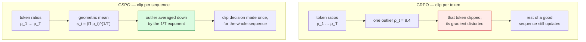

# GSPO — sequence-level policy optimization

*Group Sequence Policy Optimization* (Qwen) — [arXiv 2507.18071](https://arxiv.org/pdf/2507.18071)

**Status: PLANNED.** No GSPO run has executed.

**Natively implemented** in this checkout: `verl/trainer/ppo/core_algos.py:1546-1610`,
`compute_policy_loss_gspo`, registered as `@register_policy_loss("gspo")`. Nothing needs to
be written — only configured.

---

## The core idea

GRPO computes the importance ratio **per token**, but the reward is assigned **per sequence**.
GSPO argues that mismatch is the instability: a single aberrant token ratio can clip or
distort the update for an entire otherwise-fine response, and the effect compounds with
sequence length.

GSPO moves the ratio — and therefore the clipping decision — to the sequence.

$$
\underbrace{\rho_{i,t}=\frac{\pi_\theta(y_{i,t}\mid x,y_{i,\lt t})}{\pi_{\theta_{\text{old}}}(y_{i,t}\mid x,y_{i,\lt t})}}_{\text{GRPO: per token}}
\qquad\Longrightarrow\qquad
\underbrace{s_i(\theta)=\left(\frac{\pi_\theta(y_i\mid x)}{\pi_{\theta_{\text{old}}}(y_i\mid x)}\right)^{1/\lvert y_i\rvert}}_{\text{GSPO: per sequence}}
$$

The exponent $1/\lvert y_i\rvert$ makes $s_i$ the **geometric mean** of the token ratios, so it
is length-normalised and comparable across responses of very different length:

$$
s_i(\theta)=\exp\!\left(\frac{1}{\lvert y_i\rvert}\sum_{t=1}^{\lvert y_i\rvert}\log\frac{\pi_\theta(y_{i,t}\mid x,y_{i,\lt t})}{\pi_{\theta_{\text{old}}}(y_{i,t}\mid x,y_{i,\lt t})}\right)
$$

Objective:

$$
\mathcal{J}_{\text{GSPO}}(\theta)=\mathbb{E}\left[\frac{1}{G}\sum_{i=1}^{G}\min\Big(s_i(\theta)\hat A_i,\ \mathrm{clip}\big(s_i(\theta),1-\epsilon,1+\epsilon\big)\hat A_i\Big)\right]
$$

**Clipping now accepts or rejects a whole sequence**, not individual tokens.



---

## How verl implements it (read from source)

A naive implementation would give every token of a sequence the same scalar $s_i$, killing
the per-token gradient path. verl uses a **stop-gradient identity** instead
(`core_algos.py:1583-1593`):

```python
seq_lengths = torch.sum(response_mask, dim=-1).clamp(min=1)
negative_approx_kl_seq = torch.sum(negative_approx_kl * response_mask, dim=-1) / seq_lengths
log_seq_importance_ratio = log_prob - log_prob.detach() + negative_approx_kl_seq.detach().unsqueeze(-1)
log_seq_importance_ratio = torch.clamp(log_seq_importance_ratio, max=10.0)
seq_importance_ratio = torch.exp(log_seq_importance_ratio)
```

which is

$$
s_{i,t}(\theta)=\mathrm{sg}\big[s_i(\theta)\big]\cdot\frac{\pi_\theta(y_{i,t}\mid x,y_{i,\lt t})}{\mathrm{sg}\big[\pi_\theta(y_{i,t}\mid x,y_{i,\lt t})\big]}
$$

In the forward pass the two $\pi_\theta$ terms cancel, so the **value** is exactly $s_i$ — the
sequence ratio. In the backward pass $\mathrm{sg}[\cdot]$ contributes nothing, so the
**gradient** flows through the live per-token $\log\pi_\theta$. Sequence-level magnitude,
token-level gradient path.

`torch.clamp(..., max=10.0)` is a numerical guard on $\log s$, i.e. $s\le e^{10}$.

---

## The diagnostic question

> **Do a few extreme token ratios dominate clipping and gradient behaviour under GRPO, and
> does the sequence-level ratio actually suppress that?**

This is answered by plotting the two distributions side by side — not by comparing reward.

| metric | GRPO | GSPO |
|---|---|---|
| ratio p01 / p05 / p50 / p95 / p99 / max | token-level | **sequence-level** |
| clip fraction (low / high) | per token | per sequence |
| clipfrac volatility across updates | expected higher | expected lower |
| correlation of clipping with response length | expected positive | expected weaker |
| entropy, KL, grad norm, reward | matched controls | |

**Expected signature if the GSPO thesis holds:** token-ratio tails are wide (heavy p99/max)
while sequence-ratio tails are narrow, and clip fraction becomes both smaller and steadier.
If token tails are *already* narrow on this workload, GSPO should show little benefit — and
that null result is a legitimate, publishable finding for this lab.

---

## Hard prerequisite — established by R0

R0 measured `actor/ppo_kl = 0.0` and `pg_clipfrac = 0.0` on both updates, because
`ppo_mini_batch_size == train_batch_size` with `ppo_epochs=1` forces
$\theta=\theta_{\text{old}}$ and hence $\rho\equiv 1$.

$$
\rho_{i,t}\equiv 1\ \Longrightarrow\ s_i=\left(\textstyle\prod_t 1\right)^{1/\lvert y_i\rvert}=1
$$

> **Both ratios collapse to exactly 1, so a GSPO-vs-GRPO comparison in that configuration
> would compare two identical constants.** The GSPO arm *must* run with
> `ppo_mini_batch_size < train_batch_size` (R1 uses 8 < 16). This is the single most
> important thing to get right before launching this experiment.

> **更正（2026-09-11，实测 ratio 分布后）**：上面这段关于「ρ≈1 / ratio 恒等于 1，所以 GSPO 测不出东西」的说法**是错的，已撤回**。实测 |ρ−1| 的 p99 是 0.055、极值到 0.42，**8% 的 token 偏离超过 1%** —— 分布是尖峰厚尾，不是窄。错在拿 `ppo_kl`（带符号均值，正负会抵消）当分布宽窄的判据。**GSPO 这个臂有东西可测，不需要先改配置。** clip-higher 作用小这条保留，但理由变成「(1.2, 1.28] 窄带里 token 太少，>20% 偏离的只占 0.05%」。证据见 [`ratio_distribution.md`](../../analysis/ratio_distribution.md)。


---

## Instrumentation gap to close first

The flight recorder currently records `actor/pg_clipfrac` and `pg_clipfrac_lower`, but
**VeRL does not emit importance-ratio quantiles** — they are marked `unavailable` in
`metrics/training_metrics.csv` and the corresponding figure panel says so rather than
plotting zeros.

Since ratio distribution *is* the entire GSPO experiment, a minimal in-trainer hook must be
added before this arm runs, recording for both token and sequence ratios:

$$
p_{01},\ p_{05},\ p_{50},\ p_{95},\ p_{99},\ \max,\ \text{mean},\ \text{std}
$$

Summary statistics only — never dump the full ratio tensor.

---

## Config

```
actor_rollout_ref.actor.policy_loss.loss_mode=gspo
actor_rollout_ref.actor.loss_agg_mode=seq-mean-token-mean   # recommended in the docstring
actor_rollout_ref.actor.clip_ratio_low=0.2
actor_rollout_ref.actor.clip_ratio_high=0.2
actor_rollout_ref.actor.ppo_mini_batch_size=<strictly less than train_batch_size>
```

The implementation docstring notes verl differs from the paper by allowing any
`loss_agg_mode`; the paper aggregates at sequence level, so `seq-mean-token-mean` is the
faithful setting.
