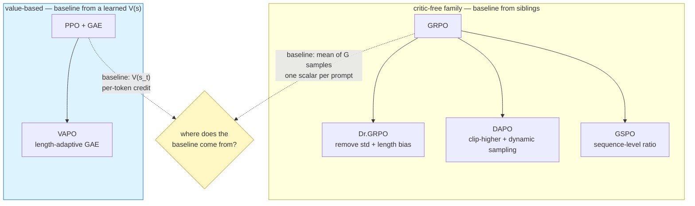

# VAPO — value-based cross-paradigm arm

*VAPO: Efficient and Reliable Reinforcement Learning for Advanced Reasoning Tasks* —
[arXiv 2504.05118](https://arxiv.org/pdf/2504.05118)

**Status: NOT IMPLEMENTED UPSTREAM.** No VAPO code exists in verl `1252cc71` or in
verl-recipe — one grep hit, a citation in `repos/verl/README.md:76`. Feasibility analysis:
[`../../analysis/vapo_feasibility.md`](../../analysis/vapo_feasibility.md).

## Why this arm exists

GRPO, Dr.GRPO, DAPO and GSPO are all **critic-free and group-based** — four variations
inside one family. Every one of them estimates the baseline from *sibling samples of the
same prompt*. VAPO takes the other road and brings the **value function** back, which makes
it the only genuinely cross-paradigm comparison in the suite.

---

## The mechanism

Instead of one outcome-level advantage broadcast to every token, GAE assigns credit
per timestep from a learned value function:

$$
\delta_t = r_t + \gamma V(s_{t+1}) - V(s_t)
$$

$$
\hat A_t^{\text{GAE}(\gamma,\lambda)} = \sum_{l=0}^{T-t-1} (\gamma\lambda)^l \, \delta_{t+l}
$$

Contrast with the group-based estimator, where **every token of response $i$ shares one
scalar**:

$$
\hat A_{i,t}^{\text{GRPO}} = \frac{r_i - \operatorname{mean}(\mathbf r)}{\operatorname{std}(\mathbf r)+\varepsilon}
\quad \text{for all } t
$$

That difference is the entire thesis: with an outcome-only reward on a 2000-token chain of
thought, GRPO tells every token it was equally responsible. A value function can, in
principle, localise credit.

### The part that is genuinely missing

$\lambda$ controls the bias–variance tradeoff, and the effective credit horizon is
$\approx 1/(1-\gamma\lambda)$. For a fixed $\lambda$, credit decays geometrically, so on a
long response the early tokens receive almost no signal. VAPO's core contribution is making
$\lambda$ **adapt to sequence length** so the horizon scales with $|y|$ rather than staying
fixed.

**That is the piece with no implementation in this stack.** Everything else — critic worker,
value loss, value clipping, GAE, explained variance — already exists in VeRL.

---

## What VeRL already provides

| VAPO component | status in verl `1252cc71` |
|---|---|
| Critic worker (FSDP + Megatron) | **available** — `verl/workers/critic/` |
| Value loss, value clipping | **available** — `compute_value_loss`, `critic.cliprange_value` |
| GAE | **available** — `algorithm.adv_estimator=gae`, `gamma`, `lam` |
| Explained variance | **available** — `critic/vf_explained_var` |
| Value / return metrics | **available** — `critic/values/*`, `critic/returns/*` |
| Token-level PG loss | **available** — shared with DAPO |
| **Length-adaptive GAE** | **ABSENT** |
| **Value warmup as a distinct stage** | **ABSENT** |

---

## Recommendation: do not reimplement first

A wrong group-advantage announces itself. R0 caught `advantages/max = ±1.5` and confirmed it
against the source arithmetic within minutes; R1 read `2.4749 / 1.6202 / 1.2076` straight off
the $G=8$ table. **A wrong GAE does not announce itself** — it produces smooth, plausible
curves with silently wrong credit assignment, and debugging that costs far more GPU-hours
than writing it.

So the staged plan is:

**Phase 1 — plain PPO + GAE + critic**, using VeRL's existing maintained path, as a 2-update
smoke test under the flight recorder. Zero new algorithm code, and it answers the questions
that actually matter for the suite:

- does an 8B actor **plus** an 8B critic fit on 4×H20? (R1 measured the actor alone at
  **40.52 GiB of 95.07**, so there is headroom, but this is unverified)
- what does the critic cost in fwd/bwd time and memory?
- is `explained_variance` even positive on outcome-only rewards over ~2000-token responses?

If explained variance is near zero, the critic is not learning a useful value function on
this task, and length-adaptive GAE would be refining something that does not work — a
result worth having before writing any code.

**Phase 2 — only if Phase 1 is healthy.** Implement length-adaptive $\lambda$ as a registered
advantage estimator, **CPU-unit-tested against hand-computed values before any GPU run.**
This is the INC-004 lesson made a rule: the expensive stage must never be the first place a
code path executes.

---

## Observability extension (already landed)

The collector now carries the value-side columns, which read `unavailable` — never `0` — on
every critic-free arm:

`value_mean` · `value_max` · `value_min` · `returns_mean` · `returns_max` · `returns_min` ·
`explained_variance` · `value_loss` · `value_clip_fraction` · `t_critic_update` · `t_values`

Still to derive when a value-based arm runs:

- TD-error statistics
- GAE advantage quantiles ($p_{01}, p_{50}, p_{99}$)
- **per-length-bucket** (short / medium / long) value error, advantage magnitude and return

That last one is the whole point of the arm. Value bias and credit decay on long CoT are
invisible in an aggregate mean; they only show up bucketed by response length.
